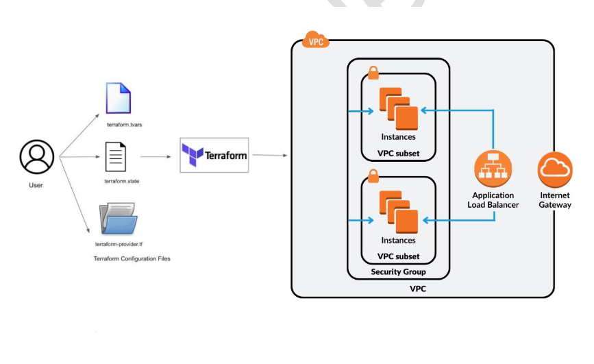
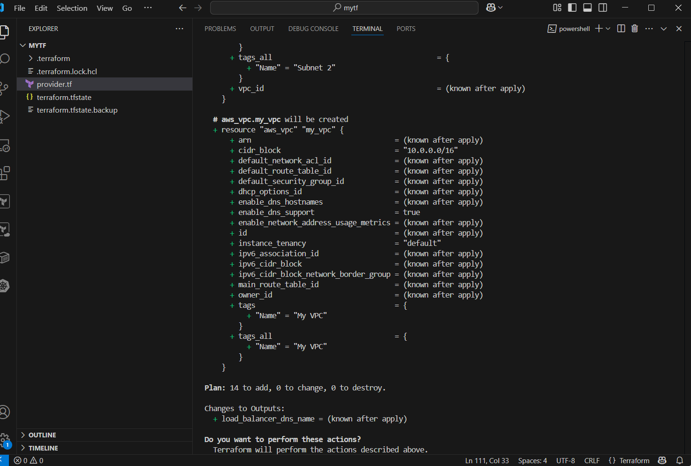
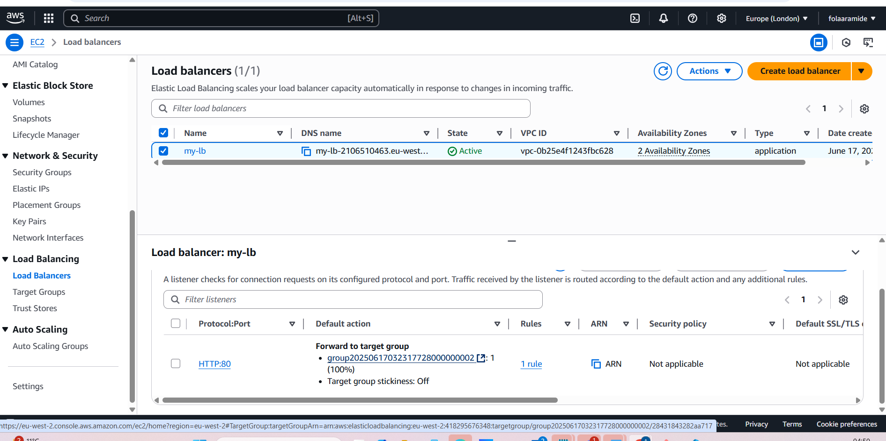
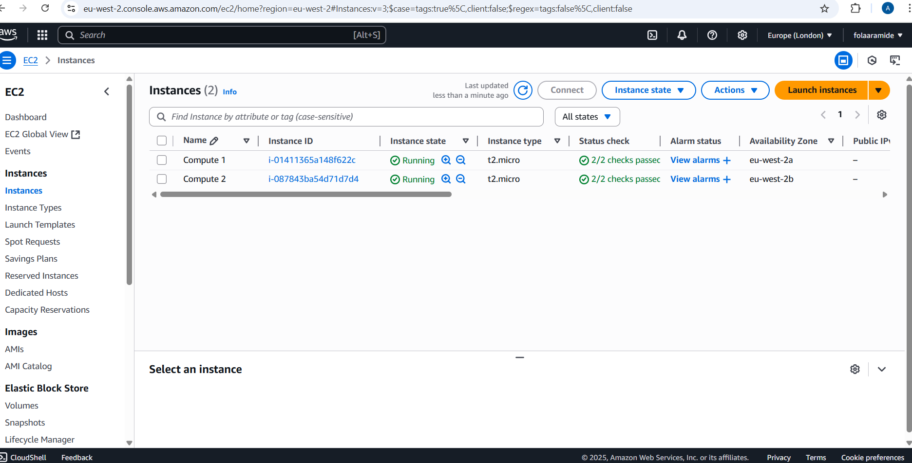
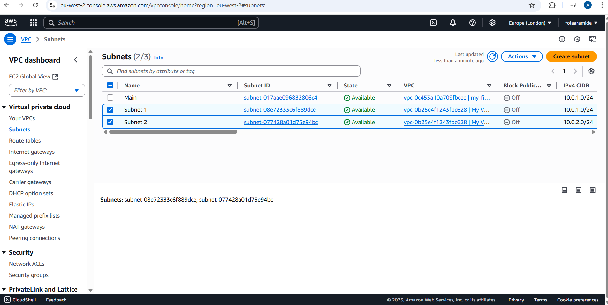

# Automate End-to-End AWS Infra with Terraform

## Project Overview
This project automates the provisioning of AWS infrastructure using Terraform. It sets up a scalable VPC with subnets, security groups, EC2 instances running NGINX, and a load balancer for handling dynamic traffic.

## Tech Stack
- AWS (VPC, EC2, ELB)
- Terraform
- NGINX web server

## Setup Instructions
1. Clone the repo:
 git clone https://github.com/folaaramide/automate-end-to-end-aws-infra-terraform.git
2. Change directory:
 cd automate-end-to-end-aws-infra-terraform/terraform
3. Initialise Terraform:
 terraform init
4. Review the plan:
 terraform plan
5. Apply the configuration:
 terraform apply
6. Verify your infrastructure in AWS Console.

## Architecture

## Screenshots

### Terraform Plan Output

### AWS Load Balancer Dashboard

### NGINX Running on EC2

### subnets

